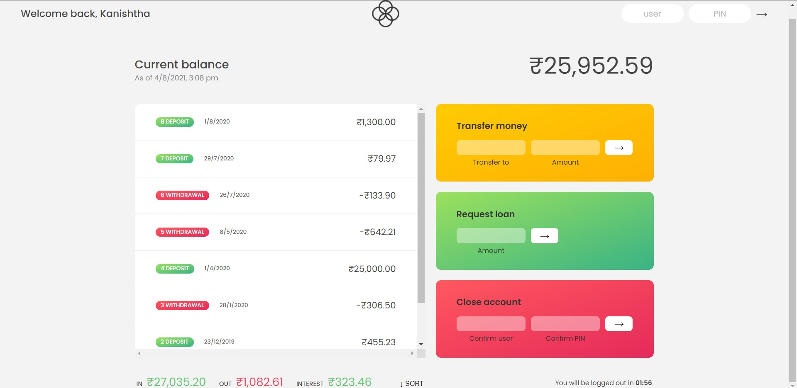

<body>
<h2 align="center">Banky App</h2>
  <h2>Description-</h2>
  

    The Banky Web-app is a basic banking model of two sample user accounts where
    the user can Transfer account from one account to the other, request for
    loan and delete his/her account.
  

  <h2>Tech Stack Used-</h2>
  

    
    
    
  

  <h2>Sample User Details-</h2>

  <ul>
    <li style="list-style: none">
      Name: Kanishtha Siyaram  
      Username: ks  
      pin: 1111
    </li>
     
    <li style="list-style: none">
      Name: Jessica Davis  
      Username: jd  
      pin: 2222
    </li>
  </ul>

  <h2>Usage-</h2>
  

    Use the username of any sample user to login and try any of the listed
    operation in the web-app.
  

  <h2 > Preview-</h2>
    

</body>
